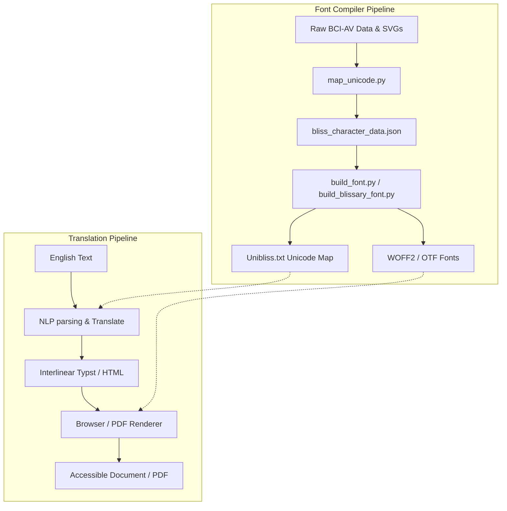
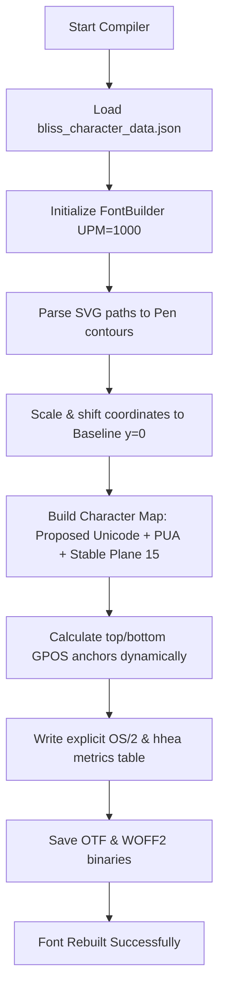

# BlissFont — OpenType Font Engineering for Blissymbolics

This project focuses on the digitization, OpenType font engineering, data parsing, and metadata compiler for Blissymbolics. It compiles vector graphics and layout rules for the **BCI Authorized Vocabulary of Blissymbolics (BCI-AV) 2025-02-15 Release** containing 6,183 active symbols.

---

## 📖 How It Works (For Laypersons)

Think of sheet music. When you read a musical score, you have the main notes, and you have small marks above or below them (like sharps, flats, or accent dots) that tell the musician how to play that note. 

**Blissymbolics** works exactly like sheet music. It is a visual language made of base pictures (like a "heart" for emotion, or "legs" for movement). To turn these pictures into actions (verbs), past tense, or plurals, we place small grammatical marks (called **indicators**) directly above or below the base symbols.

To make this work on computers and websites, this repository builds the **digital typeface (the font)**:
1. **The Font File (WOFF2/OTF)**: Contains all 6,000+ drawings and indicators.
2. **Invisible Layout Instructions (GPOS)**: Contains mathematical "magnets." When a web browser sees a base symbol followed by a grammar indicator, the font automatically snaps the indicator to the exact top or bottom center of the base symbol, aligning them with pixel-perfect precision.

---

## 📐 High-Level Architecture

The `BlissFont` pipeline acts as the compiler that translates raw BCI vector databases into web-ready typography, which is then consumed by the translation engine in `BlissNLP`.



---

## 📂 Directory Structure

```text
BlissFont/
├── pyproject.toml            # Python dependencies (managed by uv)
├── README.md                 # This documentation
├── data/
│   ├── raw/                  # [Gitignored] Raw BCI data (zips, xlsx, PDF proposals)
│   └── processed/            # Compiled databases, JSON records, WOFF2/OTF binaries
│       ├── BlissFont-*.otf   # Outline font weights (Regular, SemiBold, Bold)
│       ├── BlissFont-*.woff2 # Web-ready outline font weights
│       ├── BlissaryFont-*.otf# Stroke-based font weights
│       └── Unibliss.txt      # Custom Unicode character property database
└── scripts/
    ├── download_data.py      # Scrapes and extracts the 2025 BCI SVGs and metadata
    ├── map_unicode.py        # Parses Unicode proposal and overrides indicator codes
    ├── build_font.py         # Compiles outline fonts & calculates GPOS anchors
    └── build_blissary_font.py# Compiles stroke-based fonts & calculates GPOS anchors
```

---

## 🛠️ Step-by-Step Font Compiler Flow

The script `build_font.py` (and its counterpart `build_blissary_font.py`) compiles SVGs into fonts using the following pipeline:



---

## 🔒 Character Encoding Standards

Every glyph in the font is mapped to three distinct Unicode layers for maximum stability and interoperability:

1. **Proposed Unicode (Standard Block)**: Maps ~1,100 symbols to their official proposed Unicode scalars (e.g. `U+167E3` for the action indicator) extracted from the ISO proposal PDF.
2. **Stable Plane 15 PUA (`0xF0000 + BCI_ID`)**: To prevent character shift when rebuilding the database, every single symbol is assigned an immutable Private Use Area codepoint based on its permanent BCI ID. This allows typesetters to safely compile documents without character shuffling.
3. **Legacy PUA (`0xE000 + index`)**: Backward-compatible dynamic mapping for older web app code.

---

## 🚀 Getting Started

### 1. Requirements
* **Python 3.10+**
* [**uv**](https://github.com/astral-sh/uv) (fast Python packaging tool)

### 2. Setup & Compilation
Run these commands in order to setup the virtual environment, download datasets, and compile the fonts:

```bash
# Install dependencies
uv sync

# Scrape and extract BCI-AV 2025 vectors & sheets
uv run python scripts/download_data.py

# Map Unicode proposals & apply manual overrides
uv run python scripts/map_unicode.py

# Compile Outline and Stroke-based fonts
uv run python scripts/build_font.py
uv run python scripts/build_blissary_font.py
```

## 📐 Layout Metrics Configuration
To guarantee vertical alignment in browser engines (correcting the zero-metrics centering bug), the compiled fonts enforce the following OS/2 and hhea metrics:
* **Ascent (Typo & Win)**: `800`
* **Descent (Typo & Win)**: `-200` (`200` Win magnitude)
* **Line Gap**: `0`
* **Em Square**: `1000`
